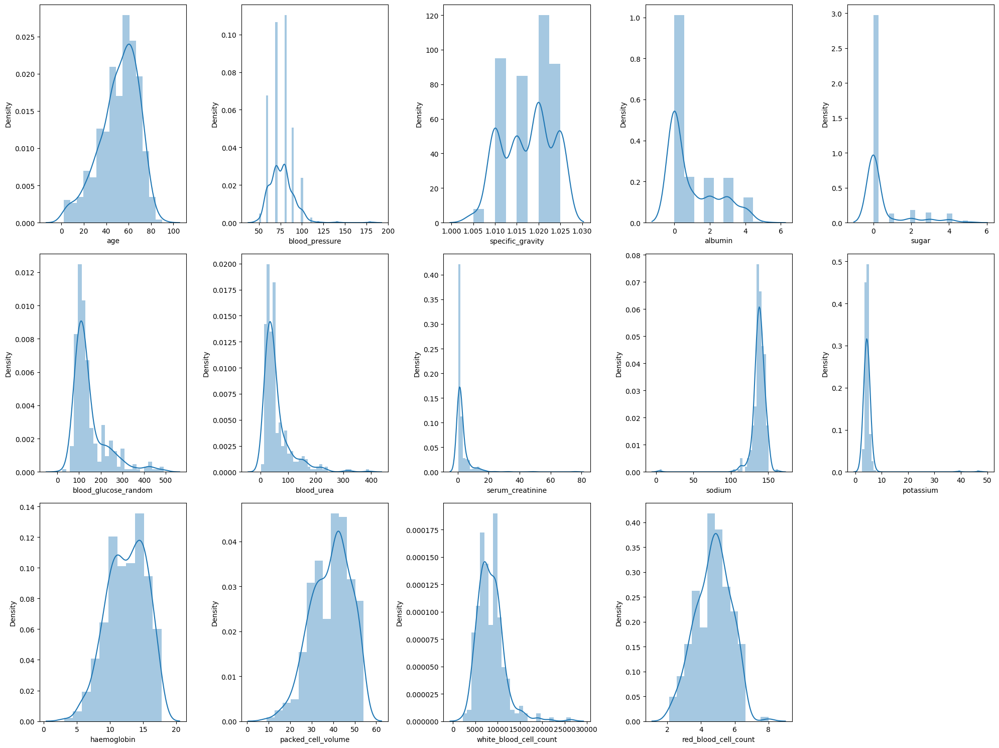
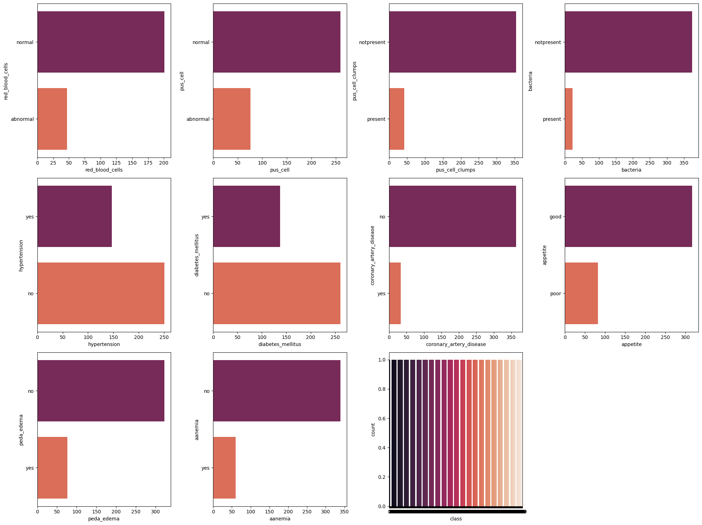
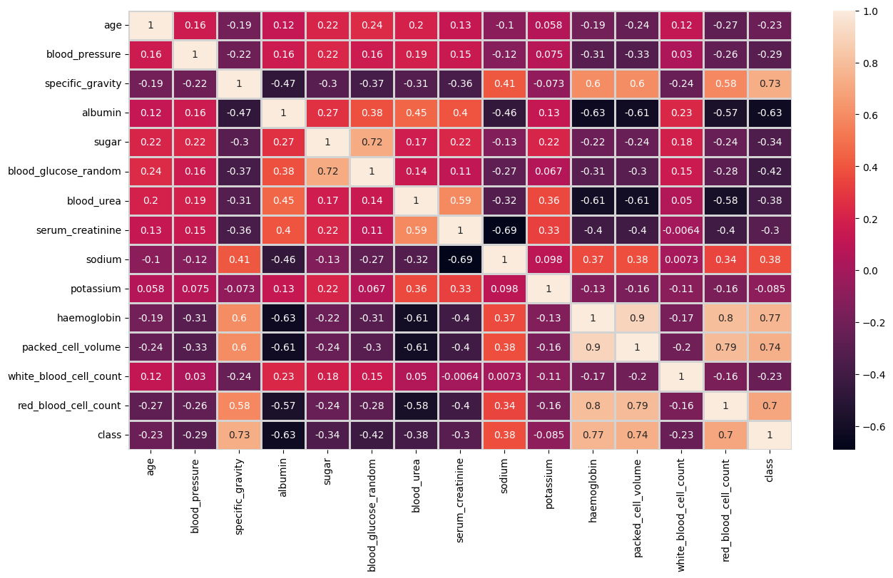
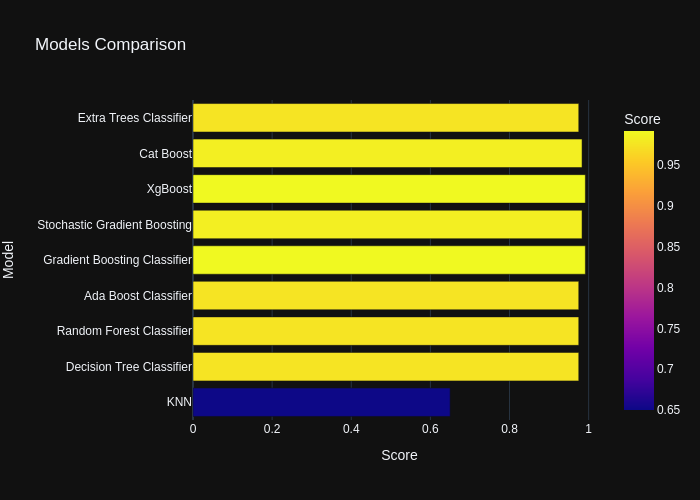

# Chronic Kidney Disease Detection Project

## Introduction

This project aims to utilize machine learning techniques to detect chronic kidney disease (CKD). By analyzing clinical data, we build models that can identify the presence of CKD in patients, potentially aiding in early diagnosis and treatment planning.

## Dataset Description

The dataset comprises various clinical features that are considered relevant for diagnosing Chronic Kidney Disease (CKD). It includes both numerical and categorical data, with features like blood pressure, specific gravity, albumin levels, sugar levels, red blood cell counts, etc.

## Distribution of Numerical Values

The distribution of numerical features gives us an insight into the spread of data points, skewness, and the presence of outliers which may influence our model's performance.

*Here we would describe any observations or relevant findings from the distributions.*

## Countplot of Categorical Values

Countplots provide a clear visual indication of the balance or imbalance within categorical features. This can be crucial for understanding the dataset's characteristics and for making decisions about preprocessing steps.

*Here we would discuss any notable imbalances and their potential impact on model training.*

## Correlation Heatmap

The heatmap of feature correlations helps in understanding the relationships between different features. Highly correlated features can sometimes be indicative of redundant information.

*In this section, elaborate on any significant correlations or patterns that could influence feature selection or engineering.*

## Models Comparison

After preprocessing and feature engineering, various machine learning models were trained and evaluated. The model comparison chart below illustrates the performance of each algorithm.

